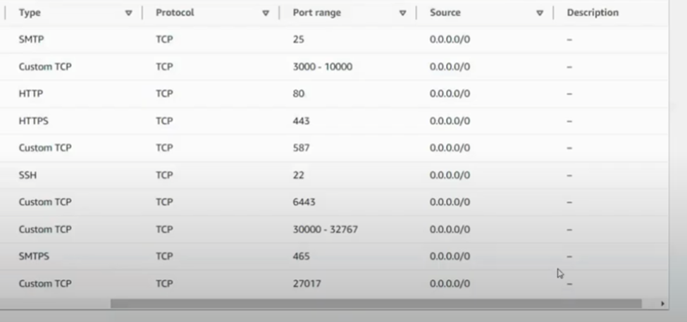
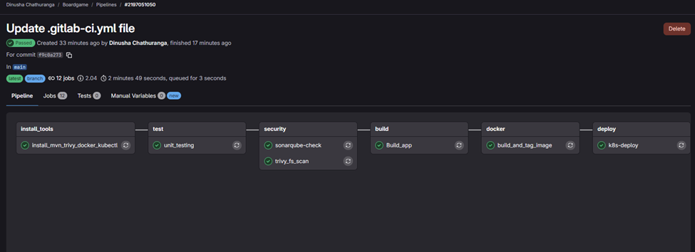
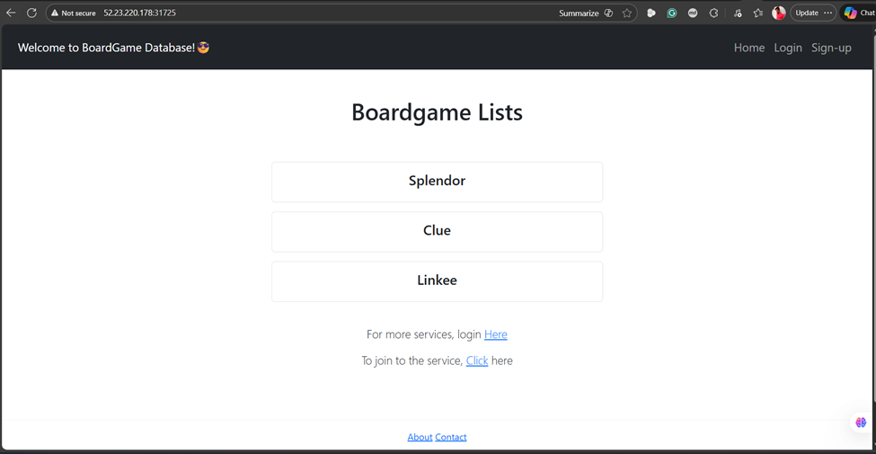
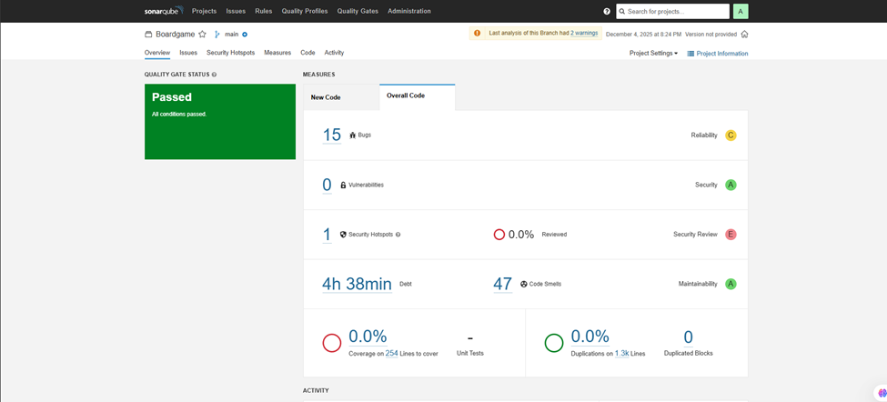

# BoardgameListingWebApp

## Description 

**Board Game Database Full-Stack Web Application.**
This web application displays lists of board games and their reviews. While anyone can view the board game lists and reviews, they are required to log in to add/ edit the board games and their reviews. The 'users' have the authority to add board games to the list and add reviews, and the 'managers' have the authority to edit/ delete the reviews on top of the authorities of users.  

## Technologies

- Java
- Spring Boot
- Amazon Web Services(AWS) EC2
- Thymeleaf
- Thymeleaf Fragments
- HTML5
- CSS
- JavaScript
- Spring MVC
- JDBC
- H2 Database Engine (In-memory)
- JUnit test framework
- Spring Security
- Twitter Bootstrap
- Maven

## Features

- Full-Stack Application
- UI components created with Thymeleaf and styled with Twitter Bootstrap
- Authentication and authorization using Spring Security
  - Authentication by allowing the users to authenticate with a username and password
  - Authorization by granting different permissions based on the roles (non-members, users, and managers)
- Different roles (non-members, users, and managers) with varying levels of permissions
  - Non-members only can see the boardgame lists and reviews
  - Users can add board games and write reviews
  - Managers can edit and delete the reviews
- Deployed the application on AWS EC2
- JUnit test framework for unit testing
- Spring MVC best practices to segregate views, controllers, and database packages
- JDBC for database connectivity and interaction
- CRUD (Create, Read, Update, Delete) operations for managing data in the database
- Schema.sql file to customize the schema and input initial data
- Thymeleaf Fragments to reduce redundancy of repeating HTML elements (head, footer, navigation)

## How to Run

1. Clone the repository
2. Open the project in your IDE of choice
3. Run the application
4. To use initial user data, use the following credentials.
  - username: bugs    |     password: bunny (user role)
  - username: daffy   |     password: duck  (manager role)
5. You can also sign-up as a new user and customize your role to play with the application! 😊

----

# GitLab CI/CD Pipeline with Kubernetes Deployment

A comprehensive CI/CD pipeline implementation using GitLab CI/CD, integrating security scanning, code quality checks, and automated deployment to a self-hosted Kubernetes cluster on AWS.

## Project Overview

This project demonstrates a complete DevOps pipeline that automates the build, test, security scanning, and deployment processes for a Java application. The pipeline leverages industry-standard tools and follows best practices for security and code quality.

### Pipeline Architecture


The CI/CD pipeline consists of six stages:

1. **Install Tools** - Sets up required dependencies
2. **Test** - Runs unit tests
3. **Security** - Performs security and quality scans
4. **Build** - Compiles and packages the application
5. **Docker** - Builds and pushes Docker images
6. **Deploy** - Deploys to Kubernetes cluster

## Key Features

- **Automated Dependency Installation**: Maven, Docker, Trivy, and kubectl
- **Unit Testing**: Maven-based test execution
- **Security Scanning**: 
  - Trivy filesystem scan for vulnerabilities and deprecations
  - Trivy image scan for container security
- **Code Quality Analysis**: SonarQube integration for code coverage and code smells
- **Containerization**: Automated Docker image building and registry push
- **Kubernetes Deployment**: Automated deployment using manifest files
- **Self-Hosted Runner**: Private GitLab runner on AWS EC2

## Prerequisites

### AWS Resources
- 3 EC2 instances (Ubuntu):
  - 1x t2.large (25GB storage) for GitLab Runner
  - 1x t3.medium (20GB storage) for Kubernetes Master
  - 1x t3.medium (20GB storage) for Kubernetes Worker

### Tools & Services
- GitLab account
- Docker Hub account
- SonarQube instance (for code quality checks)
- AWS account with appropriate permissions

## Architecture Components

### 1. GitLab Runner Setup

#### Why Private Runner?

Private runners offer several advantages over shared GitLab runners:
- **Performance**: Dedicated resources without queuing
- **Security**: Isolated environment for sensitive operations
- **Customization**: Full control over runner configuration and installed tools
- **Cost Control**: Predictable costs vs. shared runner minute consumption
- **Network Access**: Direct access to private resources and internal services

#### Security Group Configuration

Open the following ports on the GitLab Runner EC2 instance:


#### Installation Steps

1. **Provision EC2 Instance**
   ```bash
   # Instance type: t2.large
   # Storage: 25GB
   # OS: Ubuntu
   ```

2. **Update System**
   ```bash
   sudo apt update
   ```

3. **Download GitLab Runner**
   ```bash
   sudo curl -L --output /usr/local/bin/gitlab-runner \
     https://gitlab-runner-downloads.s3.amazonaws.com/latest/binaries/gitlab-runner-linux-amd64
   ```

4. **Configure Permissions**
   ```bash
   sudo chmod +x /usr/local/bin/gitlab-runner
   ```

5. **Create GitLab Runner User**
   ```bash
   sudo useradd --comment 'GitLab Runner' --create-home gitlab-runner --shell /bin/bash
   ```

6. **Install as Service**
   ```bash
   sudo gitlab-runner install --user=gitlab-runner --working-directory=/home/gitlab-runner
   sudo gitlab-runner start
   ```

7. **Register Runner**
   ```bash
   gitlab-runner register --url https://gitlab.com --token <your-token>
   ```
   
   When prompted, provide:
   - **URL**: `https://gitlab.com`
   - **Name**: `ec2-runner`
   - **Executor**: `shell`

8. **Verify Runner**
   ```bash
   gitlab-runner run
   ```

### 2. Kubernetes Cluster Setup

A self-hosted Kubernetes cluster with one master and one worker node.

#### Cluster Architecture
- **Master Node**: Controls the cluster, schedules pods
- **Worker Node**: Runs application workloads

#### Installation Steps

**Run on Both Master and Worker Nodes:**

```bash
# Update system
sudo apt-get update

# Install Docker
sudo apt install docker.io -y
sudo chmod 666 /var/run/docker.sock

# Install prerequisites
sudo apt-get install -y apt-transport-https ca-certificates curl gnupg
sudo mkdir -p -m 755 /etc/apt/keyrings

# Add Kubernetes repository
curl -fsSL https://pkgs.k8s.io/core:/stable:/v1.30/deb/Release.key | \
  sudo gpg --dearmor -o /etc/apt/keyrings/kubernetes-apt-keyring.gpg

echo 'deb [signed-by=/etc/apt/keyrings/kubernetes-apt-keyring.gpg] \
  https://pkgs.k8s.io/core:/stable:/v1.30/deb/ /' | \
  sudo tee /etc/apt/sources.list.d/kubernetes.list

# Install Kubernetes components
sudo apt update
sudo apt install -y kubeadm=1.30.0-1.1 kubelet=1.30.0-1.1 kubectl=1.30.0-1.1
```

**On Master Node Only:**

```bash
# Initialize cluster
sudo kubeadm init --pod-network-cidr=10.244.0.0/16

# Save the join token from output for worker node

# Configure kubectl
mkdir -p $HOME/.kube
sudo cp -i /etc/kubernetes/admin.conf $HOME/.kube/config
sudo chown $(id -u):$(id -g) $HOME/.kube/config

# Install Calico network plugin
kubectl apply -f https://raw.githubusercontent.com/projectcalico/calico/v3.24.0/manifests/calico.yaml

# Install Ingress NGINX controller
kubectl apply -f https://raw.githubusercontent.com/kubernetes/ingress-nginx/controller-v0.49.0/deploy/static/provider/baremetal/deploy.yaml
```

**On Worker Node:**

```bash
# Join the cluster (use token from master node initialization)
sudo kubeadm join <master-ip>:6443 --token <token> \
  --discovery-token-ca-cert-hash sha256:<hash>
```

**Verify Cluster:**

```bash
kubectl get nodes
kubectl get pods -n kube-system
```

## CI/CD Pipeline Configuration


### Pipeline Stages

#### Stage 1: Install Tools
Installs all required dependencies on the runner:
- OpenJDK 17
- Maven
- Docker
- Trivy (security scanner)
- kubectl

```yaml
install_mvn_trivy_docker_kubectl:
  stage: install_tools
  script:
    - sudo apt install -y openjdk-17-jre-headless
    - sudo apt install -y maven
    - sudo apt install -y docker.io && sudo chmod 666 /var/run/docker.sock
    - sudo apt-get install wget gnupg
    - wget -qO - https://aquasecurity.github.io/trivy-repo/deb/public.key | gpg --dearmor | sudo tee /usr/share/keyrings/trivy.gpg > /dev/null
    - echo "deb [signed-by=/usr/share/keyrings/trivy.gpg] https://aquasecurity.github.io/trivy-repo/deb generic main" | sudo tee -a /etc/apt/sources.list.d/trivy.list
    - sudo apt-get update
    - sudo apt-get install trivy
    - sudo snap install kubectl --classic
  tags:
    - self-hosted
```

#### Stage 2: Unit Testing
Executes Maven unit tests:

```yaml
unit_testing:
  stage: test
  script:
    - mvn test
  tags:
    - self-hosted
```

#### Stage 3: Security Scanning

**Trivy Filesystem Scan:**
```yaml
trivy_fs_scan:
  stage: security
  script:
    - trivy fs --format table -o fs.html .
  tags:
    - self-hosted
```

**SonarQube Code Quality:**
```yaml
sonarqube-check:
  stage: security
  image:
    name: sonarsource/sonar-scanner-cli:latest
  variables:
    SONAR_USER_HOME: "${CI_PROJECT_DIR}/.sonar"
    GIT_DEPTH: "0"
  cache:
    key: "${CI_JOB_NAME}"
    paths:
      - .sonar/cache
  script:
    - sonar-scanner
  allow_failure: true
  only:
    - main
```

#### Stage 4: Build Application
Compiles and packages the application:

```yaml
Build_app:
  stage: build
  script:
    - mvn package
  tags:
    - self-hosted
  only:
    - main
```

#### Stage 5: Docker Image Build & Push
Builds Docker image and pushes to Docker Hub:

```yaml
build_and_tag_image:
  stage: docker
  script:
    - docker login -u $DOCKER_USERNAME -p $DOCKER_PASSWORD
    - mvn package
    - docker build -t dinusha2001/boardgamegitlab:latest .
    - docker push dinusha2001/boardgamegitlab:latest
  tags:
    - self-hosted
  only:
    - main
```

#### Stage 6: Kubernetes Deployment
Deploys application to K8s cluster:

```yaml
k8s-deploy:
  stage: deploy
  variables:
    KUBECONFIG_PATH: /tmp/kubeconfig
  before_script:
    - mkdir -p $(dirname "$KUBECONFIG_PATH")
    - echo "$KUBECONFIG_CONTENT" > "$KUBECONFIG_PATH"
    - export KUBECONFIG="$KUBECONFIG_PATH"
  script:
    - kubectl apply -f deployment-service.yaml
  after_script:
    - rm -f "$KUBECONFIG_PATH"
  tags:
    - self-hosted
  only:
    - main
```

## Configuration Requirements

### GitLab CI/CD Variables

Set the following variables in GitLab (Settings → CI/CD → Variables):

- `DOCKER_USERNAME`: Your Docker Hub username
- `DOCKER_PASSWORD`: Your Docker Hub password/token
- `KUBECONFIG_CONTENT`: Base64 encoded kubeconfig file from master node

To get kubeconfig content:
```bash
cat ~/.kube/config | base64 -w 0
```

### SonarQube Configuration

Create a `sonar-project.properties` file in your project root:

```properties
sonar.projectKey=your-project-key
sonar.projectName=Your Project Name
sonar.projectVersion=1.0
sonar.sources=src
sonar.java.binaries=target/classes
sonar.sourceEncoding=UTF-8
```

## Deployment Manifest

Create a `deployment-service.yaml` file:

```yaml
apiVersion: apps/v1
kind: Deployment
metadata:
  name: boardgame-deployment
spec:
  replicas: 2
  selector:
    matchLabels:
      app: boardgame
  template:
    metadata:
      labels:
        app: boardgame
    spec:
      containers:
      - name: boardgame
        image: dinusha2001/boardgamegitlab:latest
        ports:
        - containerPort: 8080
---
apiVersion: v1
kind: Service
metadata:
  name: boardgame-service
spec:
  type: NodePort
  selector:
    app: boardgame
  ports:
  - protocol: TCP
    port: 8080
    targetPort: 8080
    nodePort: 31725
```

## Usage

1. **Push code to GitLab repository**
   - Pipeline triggers automatically on push to main branch

2. **Monitor pipeline**
   - View pipeline progress in GitLab CI/CD → Pipelines
   - Check logs for each stage

3. **Access deployed application**


   ```bash
   # Get node IP
   kubectl get nodes -o wide
   
   # Access application
   http://<node-ip>:30080
   ```

4. **View running pods**
   ```bash
   kubectl get pods
   kubectl get services
   ```

## Security Scans

### Trivy Scans
- **Filesystem Scan**: Checks for vulnerabilities in dependencies, deprecated packages, and version issues
- **Image Scan**: Scans Docker images for vulnerabilities in base images and layers

### SonarQube Analysis
- Code quality metrics
- Code coverage
- Code smells detection
- Security hotspots
- Technical debt calculation

## Troubleshooting

### Runner Issues
```bash
# Check runner status
gitlab-runner status

# View runner logs
sudo journalctl -u gitlab-runner -f

# Restart runner
sudo gitlab-runner restart
```

### Kubernetes Issues
```bash
# Check node status
kubectl get nodes

# Check pod status
kubectl get pods -A

# View pod logs
kubectl logs <pod-name>

# Describe pod for events
kubectl describe pod <pod-name>
```

### Docker Issues
```bash
# Check Docker daemon
sudo systemctl status docker

# View Docker logs
docker logs <container-id>

# Check Docker permissions
ls -l /var/run/docker.sock
```

## Best Practices Implemented

1. **Security First**: Multiple scanning layers (Trivy + SonarQube)
2. **Code Quality**: Automated quality gates with SonarQube
3. **Isolated Environments**: Private runner for secure builds
4. **Automated Testing**: Unit tests run on every commit
5. **Container Security**: Image scanning before deployment
6. **Cleanup**: Temporary files removed after deployment

## Future Enhancements

- Add integration tests stage
- Implement blue-green deployment strategy
- Add Helm charts for easier Kubernetes management
- Set up monitoring with Prometheus and Grafana
- Implement automatic rollback on deployment failure
- Add staging environment
- Configure horizontal pod autoscaling
- Implement secrets management with Vault or AWS Secrets Manager


## License

This project is licensed under the MIT License.

## Author

Chathuranga Jayasooriya

## Acknowledgments

- GitLab CI/CD Documentation
- Kubernetes Official Documentation
- Trivy Security Scanner
- SonarQube Community
